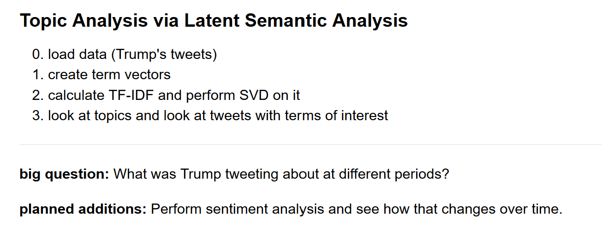
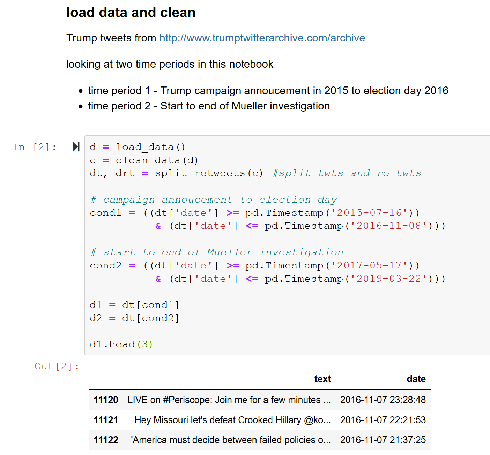
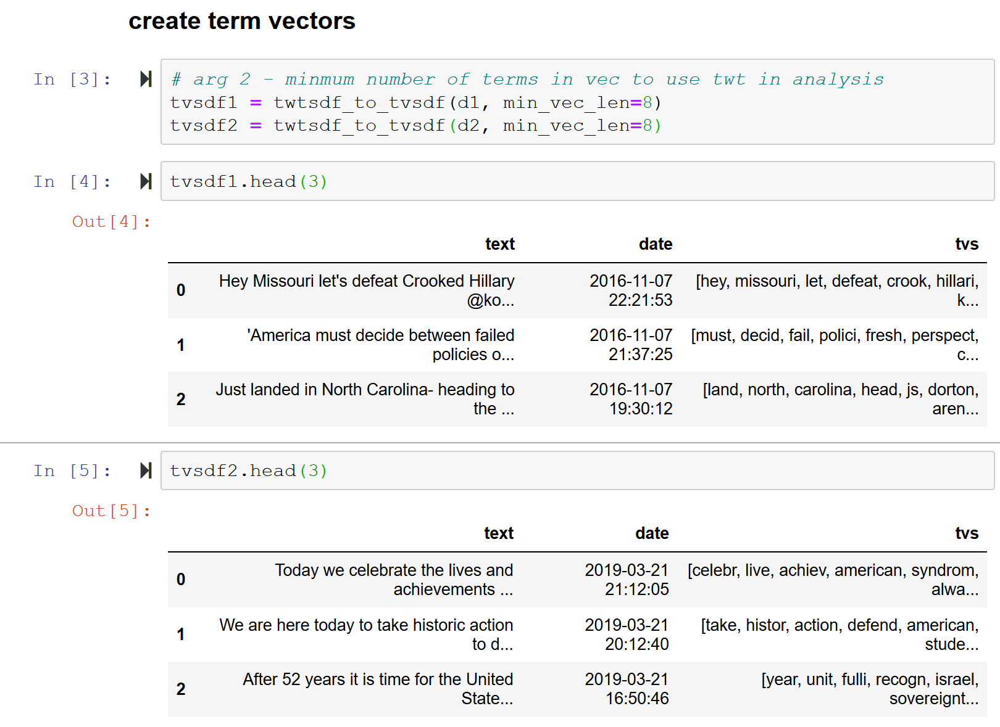
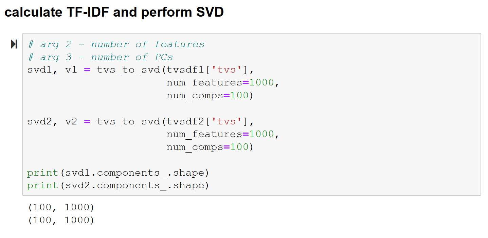
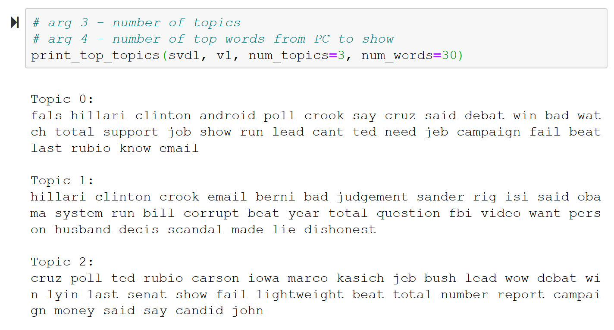
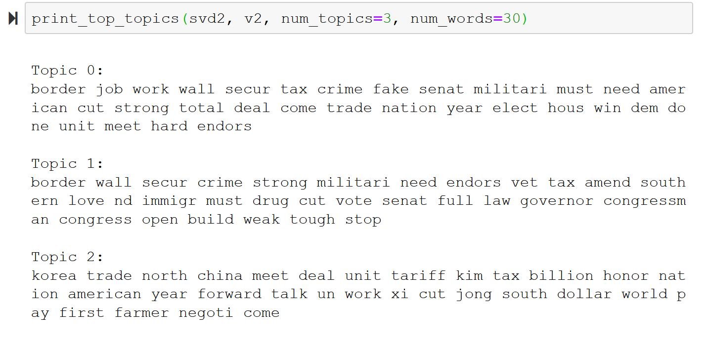
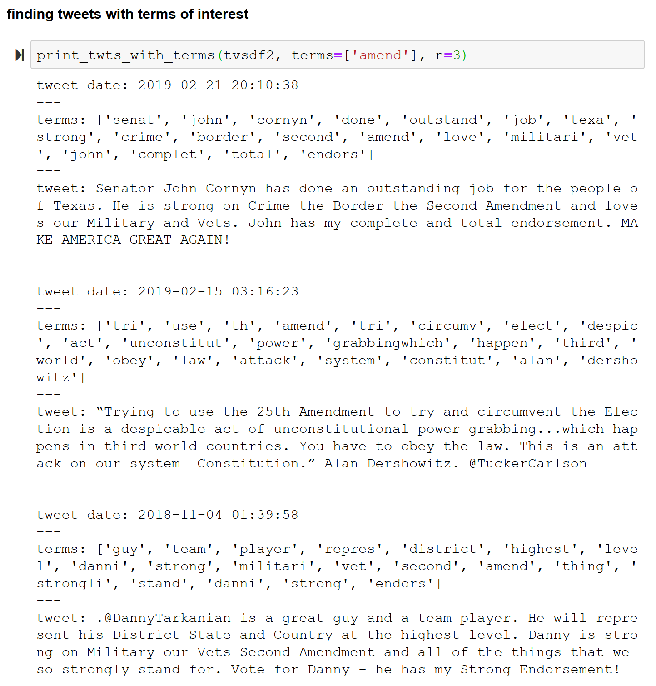

# trump-vs-trump
Text Analytics on Trump tweets across the years. 

All code contained in the jupyter notebook on this repo. Functions are built to easily change how the analysis is ran and to parse results easily

---

### Code Walkthrough

---

---

---

#### topics

---

#### tweets with given terms

